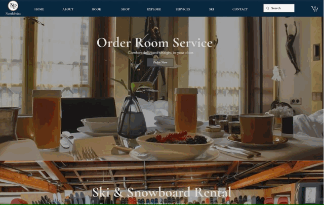

# NorthPoint Ski Resort Project

# [North Point Ski Resort Live Website Link(Click me!)](https://amyxbian.editorx.io/northpoint)

This is a Ski Resort Business Solution developed for Washington FBLA's E-Business competition.
The main business idea is to integrate hotel, ski service, entertainment, and environment together to provide 
solutions for a fictional ski resort business in the United States.
# Main Features
Customers can use this web portal to browse our fictional NorthPoint ski resort. 
We utilized big visuals and an About Me section to showcase the beautiful resort.  Customers can learn about the real-time weather 
conditions and local surroundings. 
They can book the rooms and rent ski equipment.  
During the stay, customers can order delicious room service food directly to their hotel room through the website.
#Technology Stack
In this project, I used editor-x，[Velo API](https://www.wix.com/velo/reference/api-overview/introduction) and 
Javascript to provide vivid visuals and e-commerce support for the customer.

## Overview of Northpoint Ski Resort 

## Book the room

## Shopping for rental and room service

## Set up this repository in your IDE
This repo is connected to a Wix site. That site tracks this repo's default branch. Any code committed and pushed to that branch from your local IDE appears on the site.

To set up your local environment and start coding locally, do the following:

1. Open your terminal and navigate to where you want to store the repo.
1. Clone the repo by running `git clone <your-repository-url>`.
1. Navigate to the repo's directory by running `cd <directory-name>`.
1. Install the repo's dependencies by running `npm install` or `yarn install`.
1. Install the Wix CLI by running `npm install -g @wix/cli` or `yarn global add @wix/cli`.  
   Once you've installed the CLI globally, you can use it with any Wix site's repo.

## Test your code with the Local Editor
The Local Editor allows you test changes made to your site in real time. The code in your local IDE is synced with the Local Editor, so you can test your changes before committing them to your repo. You can also change the site design in the Local Editor and sync it with your IDE.

Start the Local Editor by navigating to this repo's directory in your terminal and running `wix dev`.

For more information, see [Working with the Local Editor](https://support.wix.com/en/article/velo-working-with-the-local-editor-beta).

## Preview and publish with the Wix CLI
The Wix CLI is a tool that allows you to work with your site locally from your computer's terminal. You can use it to build a preview version of your site and publish it. You can also use the CLI to install [approved npm packages](https://support.wix.com/en/article/velo-working-with-npm-packages) to your site.

Learn more about [working with the Wix CLI](https://support.wix.com/en/article/velo-working-with-the-wix-cli-beta).
